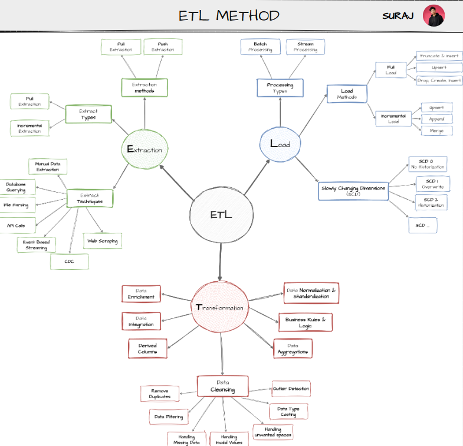

# 🏗️ SQL Data Warehouse

This module contains the complete implementation of a modern SQL Data Warehouse built using **Microsoft SQL Server** and the **Medallion Architecture**. The project demonstrates the complete ETL process—from ingesting raw CSV files to delivering business-ready dimensional models for analytics and reporting.

---

# 📖 Overview

The objective of this project is to design and implement a scalable data warehouse capable of integrating multiple source systems into a single analytical database.

The warehouse follows the Medallion Architecture, separating data into three layers:

- 🥉 Bronze – Raw source data
- 🥈 Silver – Cleaned and standardized data
- 🥇 Gold – Business-ready dimensional model

This layered approach improves data quality, simplifies maintenance, and provides a reliable foundation for downstream analytics.

---

# 🏛️ Medallion Architecture


### Bronze Layer

The Bronze layer stores raw data exactly as received from the source systems.

Characteristics:

- Raw CSV ingestion
- No business transformations
- Preserves original data
- Serves as the landing zone for ETL

---

### Silver Layer

The Silver layer cleans and standardizes the raw data.

Transformations include:

- Removing duplicates
- Handling NULL values
- Standardizing formats
- Data validation
- Data type conversions
- Business rule implementation

---

### Gold Layer

The Gold layer contains business-ready tables designed for analytical workloads.

Features:

- Star Schema
- Dimension Tables
- Fact Tables
- Optimized for reporting and analytics

---

# 📂 Project Structure

```
01_Data_Warehousing
│
├── datasets
│   ├── source_crm
│   └── source_erp
│
├── docs
│   ├── Data_Architecture.png
│   ├── Data_Catalog.md
│   ├── Data_model.png
│   ├── ETL.png
│   └── Naming_Conventions.md
│
├── scripts
│   ├── bronze
│   │   ├── ddl_bronze.sql
│   │   └── proc_load_bronze.sql
│   │
│   ├── silver
│   │   ├── ddl_silver.sql
│   │   ├── proc_load_silver.sql
│   │   └── placeholder
│   │
│   ├── gold
│   │   └── ddl_gold.sql
│   │
│   └── init_database.sql
│
├── tests
│   ├── quality_check_gold.sql
│   └── quality_check_silver.sql
│
└── README.md
```

---

# 📊 Data Sources

The warehouse integrates data from two operational systems.

### CRM

Contains customer and product information.

### ERP

Contains sales transactions and operational business data.

Both datasets are provided as CSV files and loaded into SQL Server.

---

# 🔄 ETL Pipeline



The ETL workflow consists of the following stages:

1. Initialize the database
2. Create Bronze tables
3. Load raw CSV files into Bronze
4. Create Silver tables
5. Clean and standardize the data
6. Create Gold tables
7. Build analytical data model
8. Perform data quality validation

---

# ⭐ Data Model


The Gold layer follows a **Star Schema** consisting of:

### Dimension Tables

- dim_customers
- dim_products

### Fact Tables

- fact_sales

This model is optimized for fast analytical queries and reporting.

---

# 📁 Documentation

The **docs** directory contains additional project documentation.

| File | Description |
|------|-------------|
| Data_Architecture.png | Medallion architecture diagram |
| ETL.png | ETL workflow |
| Data_model.png | Star schema |
| Data_Catalog.md | Dataset documentation |
| Naming_Conventions.md | Naming standards used throughout the project |

---

# 🧪 Data Quality Testing

Quality checks are included to ensure the reliability of the warehouse.

Validation includes:

- NULL checks
- Duplicate detection
- Referential integrity
- Data consistency
- Business rule validation

Test scripts are located in:

```
tests/
```

---

# 💻 Technologies Used

- Microsoft SQL Server
- SQL Server Management Studio (SSMS)
- T-SQL
- CSV Files
- Medallion Architecture
- Star Schema
- ETL

---

# 🛠 SQL Concepts Demonstrated

This project showcases practical use of:

- DDL
- Stored Procedures
- Views
- Common Table Expressions (CTEs)
- Joins
- CASE Expressions
- Window Functions
- Data Cleansing
- Data Transformation
- Surrogate Keys
- Data Modeling

---

# 🚀 Execution Order

Run the SQL scripts in the following order:

```
1. init_database.sql

2. bronze/
   ├── ddl_bronze.sql
   └── proc_load_bronze.sql

3. silver/
   ├── ddl_silver.sql
   └── proc_load_silver.sql

4. gold/
   └── ddl_gold.sql

5. tests/
   ├── quality_check_silver.sql
   └── quality_check_gold.sql
```

---

# 🎯 Project Outcomes

After completing this module, the warehouse provides:

- Clean and validated data
- Integrated CRM and ERP datasets
- Star Schema for analytics
- Business-ready fact and dimension tables
- Reliable data for reporting and dashboard development

---

# 📚 Learning Outcomes

This project strengthened my understanding of:

- Data Warehouse Design
- ETL Development
- Medallion Architecture
- SQL Server
- Data Cleaning
- Data Validation
- Star Schema Modeling
- Data Engineering Best Practices
