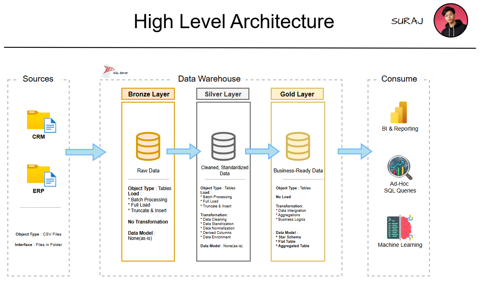
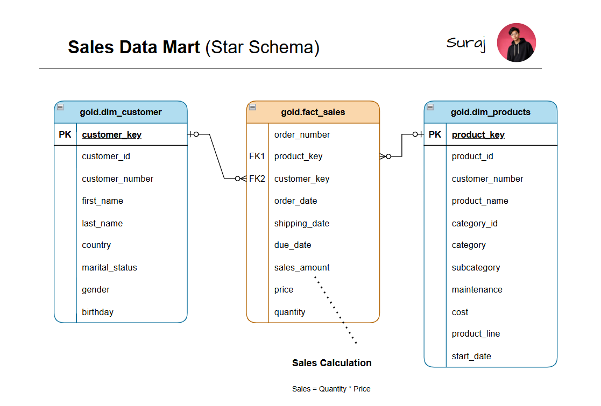
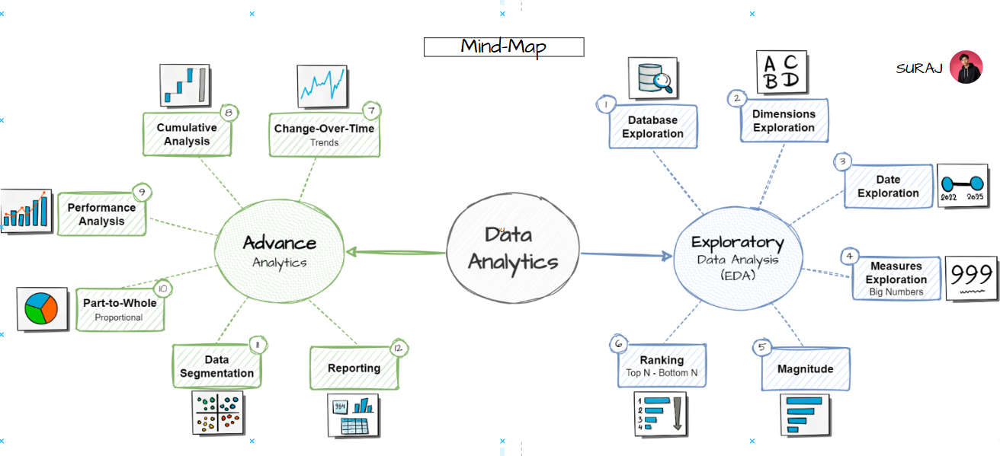

# 🚴 Bike Sales Data Warehouse & Analytics

<p align="center">
  <strong>An End-to-End SQL Project that transforms raw bike sales data into business-ready insights.</strong>
</p>

<p align="center">


</p>

---

# 📖 About The Project

Every business collects data, but raw data alone doesn't answer important business questions.

Questions like:

* Which products generate the highest revenue?
* Who are our most valuable customers?
* How have sales changed over time?
* Which product categories contribute the most?
* Which customers should be retained?

require clean, organized, and well-structured data.

This project demonstrates the complete journey of transforming raw bike sales data into meaningful business insights using **SQL Server**.

Starting from raw CSV files, the project builds a modern **Data Warehouse** using the **Medallion Architecture**, performs **Exploratory Data Analysis (EDA)**, and finally develops **Business Analytics Reports** that support data-driven decision making.

Whether you're a recruiter, student, or data enthusiast, this repository showcases a real-world SQL workflow from data engineering to business analytics.

---

# 🏗️ Solution Architecture

The project follows the **Medallion Architecture**, where data is progressively refined from raw files into business-ready datasets.

<p align="center">

</p>

### Architecture Layers

🥉 **Bronze Layer**

* Stores raw data from CRM and ERP systems
* No transformations
* Serves as the landing zone for ETL

---

🥈 **Silver Layer**

* Cleans and validates the data
* Removes duplicates
* Handles missing values
* Standardizes formats
* Applies business rules

---

🥇 **Gold Layer**

* Creates business-ready tables
* Implements a Star Schema
* Optimized for reporting and analytics

---

# 🔄 End-to-End Project Workflow

```text
                    Raw CSV Files
                          │
                          ▼
               SQL Data Warehouse
                          │
        ┌─────────────────┼─────────────────┐
        ▼                 ▼                 ▼
   Bronze Layer      Silver Layer      Gold Layer
                          │
                          ▼
          Exploratory Data Analysis (EDA)
                          │
                          ▼
              SQL Business Analytics
                          │
                          ▼
         Customer Report & Product Report
                          │
                          ▼
               Business Insights
```

---

# 📂 Repository Structure

```text
Bike-Sales-Data-Warehouse-Analytics
│
├── 01_Data_Warehousing
│
├── 02_Exploratory_Data_Analysis
│
├── 03_Data_Analytics
│
├── datasets
│
├── LICENSE
│
└── README.md
```

---

# 🚀 Project Modules

## 🏗️ Module 1 — SQL Data Warehouse

This module focuses on designing and building a modern SQL Data Warehouse.

Starting with raw CRM and ERP datasets, the data is loaded into SQL Server and transformed through multiple ETL stages using the Medallion Architecture.

<p align="center">

</p>

### Highlights

* Modern Medallion Architecture
* Bronze, Silver & Gold Layers
* ETL Pipeline Development
* Data Cleaning & Validation
* Star Schema Design
* Data Modeling
* Quality Checks

📁 **Folder:** `01_Data_Warehousing`

➡️ **Detailed Documentation:**
`01_Data_Warehousing/README.md`

---

## 🔍 Module 2 — Exploratory Data Analysis

Before analyzing the business, it's important to understand the data.

This module explores the warehouse and validates the dataset by answering questions like:

* What tables are available?
* What information does each table contain?
* What is the date range?
* Which dimensions and measures exist?
* Are there missing values?
* Which countries and product categories are represented?

### Topics Covered

* Database Exploration
* Date Range Analysis
* Dimension Exploration
* Measure Exploration
* Magnitude Analysis
* Ranking Analysis

📁 **Folder:** `02_Exploratory_Data_Analysis`

➡️ **Detailed Documentation:**
`02_Exploratory_Data_Analysis/README.md`

---

## 📊 Module 3 — SQL Business Analytics

Once the data is prepared and validated, the final step is transforming it into business insights.

This module answers real business questions using SQL and produces reusable reports for decision-makers.

<p align="center">

</p>

### Business Analyses

* 📈 Change Over Time Analysis
* 📊 Cumulative Analysis
* 🏆 Performance Analysis
* 🎯 Contribution Analysis
* 👥 Customer Segmentation

### Business Reports

#### 👤 Customer Report

Provides a complete view of customer behavior, including:

* Customer Information
* Customer Segmentation
* Total Orders
* Total Sales
* Customer Lifetime
* Average Order Value
* Recency
* Monthly Spend

---

#### 📦 Product Report

Provides a complete overview of product performance.

Includes:

* Product Information
* Product Categories
* Revenue
* Quantity Sold
* Customer Reach
* Product Performance
* Product Segmentation
* Average Selling Price
* Revenue KPIs

📁 **Folder:** `03_Data_Analytics`

➡️ **Detailed Documentation:**
`03_Data_Analytics/README.md`

---

# 💡 Skills Demonstrated

### 🏗️ Data Engineering

* SQL Server
* ETL Pipeline Development
* Data Warehousing
* Medallion Architecture
* Data Cleaning
* Data Validation
* Data Modeling
* Star Schema Design

---

### 📊 Data Analytics

* Exploratory Data Analysis
* Business Analytics
* KPI Development
* Customer Segmentation
* Product Performance Analysis
* Sales Trend Analysis
* Business Reporting

---

### 💻 SQL

* Joins
* Common Table Expressions (CTEs)
* Window Functions
* Aggregate Functions
* CASE Expressions
* Ranking Functions
* Views
* Date Functions
* GROUP BY & HAVING

---

# 🛠️ Technologies Used

<p>


</p>

---

# 🎯 Key Project Highlights

✅ End-to-End SQL Project

✅ Modern Medallion Architecture

✅ ETL Pipeline Development

✅ Star Schema Design

✅ Data Quality Validation

✅ Exploratory Data Analysis

✅ Business KPI Development

✅ Customer Segmentation

✅ Product Performance Analysis

✅ Customer & Product Reports

✅ Reusable SQL Views

---

# 🌟 Why This Project?

The objective of this project was to simulate a real-world data engineering and analytics workflow.

Rather than focusing only on SQL queries, this repository demonstrates the complete lifecycle of data:

* Raw Data → Structured Warehouse
* Structured Warehouse → Business Analysis
* Business Analysis → Actionable Insights

This mirrors the workflow commonly followed by **Data Engineers**, **Analytics Engineers**, and **Data Analysts** in modern organizations.

---

# 📚 Explore Each Module

| Module                           | Description                                                    |
| -------------------------------- | -------------------------------------------------------------- |
| **01_Data_Warehousing**          | Build the SQL Data Warehouse using the Medallion Architecture. |
| **02_Exploratory_Data_Analysis** | Explore, validate, and understand the warehouse data.          |
| **03_Data_Analytics**            | Perform business analytics and generate reusable reports.      |

---

# 📬 Connect With Me

<p align="left">

<a href="https://www.linkedin.com/in/surajkumar-analytics/">


</a>

</p>

If you found this project helpful or have suggestions for improvement, feel free to connect with me or open an issue.

---

# ⭐ Support

If you found this project useful or learned something from it, consider giving the repository a ⭐.

It helps others discover the project and motivates me to continue building and sharing more data engineering and analytics projects.

Thank you for visiting! 🚀
